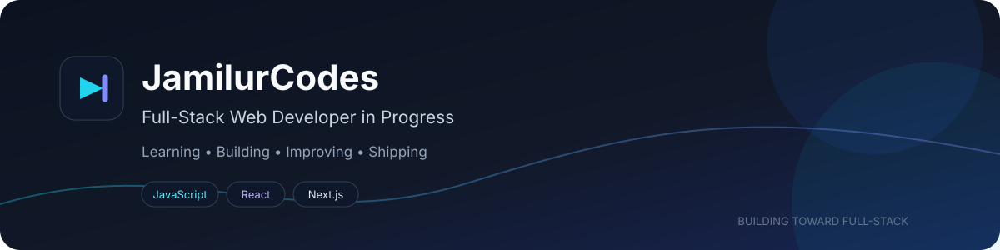

<p align="center">
  
</p>

<h1 align="center">Hi, I'm Jamilur Rahman Dilwar 👋</h1>

<p align="center">
  <strong>Full-Stack Web Developer in Progress</strong>
</p>

<p align="center">
  I build responsive web applications and am growing from frontend development toward full-stack and AI-powered development.
</p>

<p align="center">
  📍 <strong>Sylhet, Bangladesh</strong> ·
  📧 <a href="mailto:dilwar.jamilur1998@gmail.com">dilwar.jamilur1998@gmail.com</a> ·
  <a href="https://github.com/JamilurCodes">GitHub</a>
</p>

---

## 👨‍💻 About Me

I'm a developer focused on becoming a strong **full-stack web developer** by learning fundamentals deeply and building real-world projects.

I started with frontend development and am now expanding toward APIs, authentication, databases, backend development, and eventually AI-powered applications.

I believe in learning by understanding the **why**, practicing concepts, and building projects instead of only following tutorials.

---

## 🚀 Currently Working On

* ⚛️ Improving **React** and component-based development
* ▲ Exploring **Next.js App Router**
* 🔐 Learning **authentication and protected routes**
* 🌐 Working with **REST APIs and data fetching**
* 🎨 Building responsive interfaces with **Tailwind CSS and daisyUI**
* 🧩 Practicing **JavaScript, TypeScript, and problem solving**
* 🛠️ Building projects to strengthen practical development skills
* 🌱 Moving gradually toward **full-stack web development**

---

## 🛠️ Skills & Technologies

<p align="center">
  
</p>

<p align="center">
  <strong>HTML • CSS • JavaScript • TypeScript • React • Next.js • Tailwind CSS • daisyUI • Git • GitHub • VS Code</strong>
</p>

### 🔭 Currently Exploring

<p align="center">
  
</p>

---

## 📊 GitHub Statistics

<p align="center">
  

  
</p>

<p align="center">
  
</p>

---

## 🌟 Featured Project

### 🏋️ FitLog — Workout Library

A dark, responsive workout library built with **Next.js App Router, TypeScript, Tailwind CSS, and daisyUI**.

Users can browse workouts, view dynamic workout details, create a personal plan, save workouts, mark workouts as completed, sort workouts, and keep their data after a browser reload.

**Main technologies:** Next.js • React • TypeScript • Tailwind CSS • daisyUI • Lucide React • React Hot Toast • REST API • localStorage

<p align="center">
  <a href="https://github.com/JamilurCodes/fitlog-workout">📂 Repository</a> ·
  <a href="https://fitlog-workout-tan.vercel.app">🚀 Live Demo</a>
</p>

---

## 🧭 My Learning Roadmap

```text
HTML / CSS
    ↓
JavaScript
    ↓
React
    ↓
Next.js
    ↓
TypeScript
    ↓
Backend & APIs
    ↓
Databases & Authentication
    ↓
Full-Stack Development
    ↓
AI-Powered Full-Stack Development
```

---

## 🎯 Current Goal

My current goal is to become **job-ready as a full-stack web developer** by building increasingly complete projects and developing a strong understanding of the technologies I use.

In the longer term, I want to become a **Full-Stack AI Engineer** capable of building useful applications from frontend to backend and integrating AI where it provides real value.

---

## 🤝 Connect With Me

<p align="center">
  <a href="mailto:dilwar.jamilur1998@gmail.com">📧 Email</a> ·
  <a href="https://github.com/JamilurCodes">🐙 GitHub</a>
</p>

---

<p align="center">
  <em>Learn → Understand → Build → Practice → Improve</em>
</p>

<p align="center">
  <sub>Building one project, one concept, and one improvement at a time. 🚀</sub>
</p>
